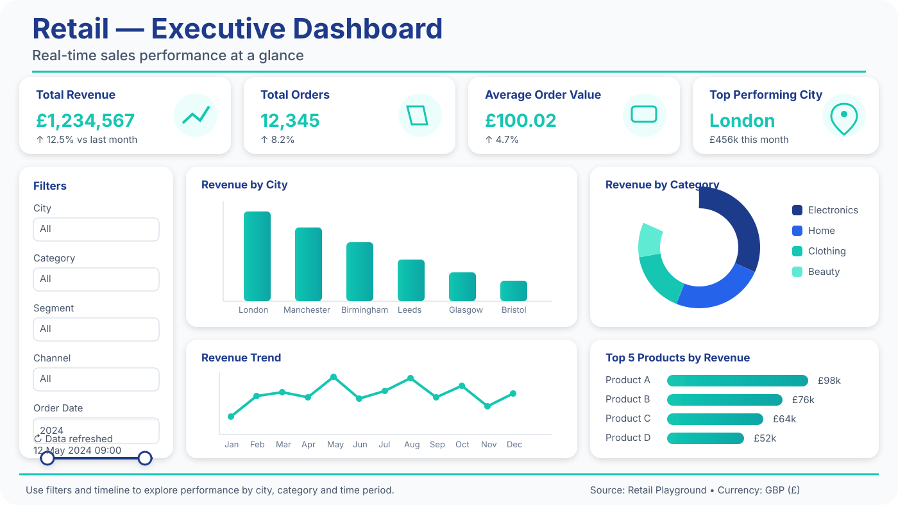
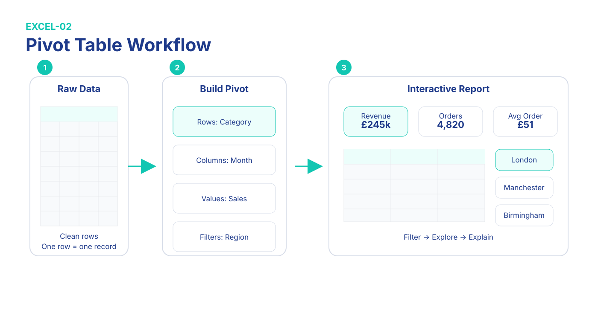

# Excel Interview Bible

# Sprint 3 — Manager's Monday Morning Dashboard

## Pivot Tables • Pivot Charts • Slicers • Timeline • Power Query

Monday.

09:00.

Your manager sends one message.

> "I need a sales dashboard in twenty minutes."

This chapter teaches exactly that workflow.

You'll build a complete business dashboard using realistic customer, order and product tables similar to those used in UK Data Analyst interviews.

---

# What We'll Build

By the end of this sprint you'll have a dashboard showing:

- Total Revenue
- Total Orders
- Average Order Value
- Top Performing City
- Best Selling Category
- Interactive Filters
- Timeline

This looks much closer to a real business dashboard than a classroom exercise.

***

## Dashboard Preview

This is the kind of executive dashboard you'll be able to build by the end of this sprint.

{#fig:executive-dashboard width=100%}

*Figure 3.0 — Executive Dashboard Preview.*

Notice how KPI cards, charts and filters work together to answer business questions quickly.

This layout represents the kind of executive dashboard commonly expected during Excel interview assignments.

***

## Dashboard Building Workflow

A professional Excel dashboard follows a repeatable process. Instead of jumping straight into charts, analysts prepare the data, build Pivot Tables, add interactive filters and finally present business insights.

{#fig:pivot-workflow width=100%}

*Figure 3.1 — Pivot Table Workflow.*

### Interview Anchor

**Import → Pivot → Visualise → Filter → Explain**

Recruiters often care more about your workflow than remembering every menu click.

---

# Step 1 — Import Data with Power Query

## Recruiter Psychology

Many UK companies expect analysts to know basic Power Query.

## Business Task

Import a sales data table using Power Query.

### Steps

1. Data
2. Get Data
3. From Text/CSV
4. Select your sales data source.
5. Load to Excel

### Explain It (B2)

> I imported the CSV using Power Query instead of copying data manually.

Memory Hook.

Power Query is the kitchen.

It prepares ingredients before cooking.

---

# Why Power Query Matters

Manual work:

- copy
- paste
- repeat

Power Query:

- refresh
- done

Interview Tip.

Mention refreshable workflows.

Recruiters like automation.

---

# Step 2 — Build Your First Pivot Table

## Business Task

Revenue by City.

### Steps

Insert

→ Pivot Table

Fields.

Rows:

- city

Values:

- Sum of amount

### Result

| City       | Revenue  |
| ---------- | -------- |
| London     | £120,000 |
| Manchester | £87,000  |

### Explain It (B2)

> The Pivot Table automatically groups cities and calculates total revenue.

Memory Hook.

Pivot Tables summarise data automatically.

---

# Question 11

Why use a Pivot Table instead of formulas?

Good answer.

> It's faster, easier to update and automatically groups data.

---

# Step 3 — Sort Highest Revenue

Right-click.

Sort.

Largest to Smallest.

Now the manager immediately sees:

- top city
- weakest city

Business before beauty.

---

# Step 4 — Create a Pivot Chart

Business Task.

Turn revenue into a chart.

Insert

→ Pivot Chart.

Choose.

Clustered Column.

Why this chart?

Easy comparison.

Interview English.

> I chose a column chart because it's easier to compare categories.

---

# Chart Psychology

Don't decorate.

Communicate.

Avoid:

- 3D charts
- unnecessary colours
- heavy shadows

Keep charts clean.

---

# Step 5 — Revenue by Category

Use your product and sales tables.

Create another Pivot Table.

Rows.

Category.

Values.

Revenue.

Business Question.

Which category performs best?

Exactly the type of question hiring managers ask.

---

# Step 6 — Add Slicers

Business Task.

Filter instantly.

Insert

→ Slicer.

Choose.

- City
- Category

Now one click changes the whole dashboard.

Memory Hook.

Slicers are remote controls.

---

# Step 7 — Add Timeline

Timeline works with dates.

Insert.

Timeline.

Choose.

Order Date.

Now the manager can switch between:

- month
- quarter
- year

This feels like a professional dashboard.

---

# Step 8 — Build KPI Cards

Create four KPI boxes.

| KPI           | Formula |
| ------------- | ------- |
| Revenue       | SUM     |
| Orders        | COUNT   |
| Average Order | AVERAGE |
| Top City      | Pivot   |

Arrange them across the top.

Exactly like executive dashboards.

---

# Formatting Like a Professional

Use.

- white background
- dark text
- consistent spacing
- aligned cards

Good dashboards feel calm.

Not crowded.

---

# Business Case — Monday Morning

The CEO asks.

> Which city should receive more marketing budget?

Workflow.

1. Filter by month.
2. Compare cities.
3. Check category.
4. Present one recommendation.

Don't say.

> "London has the highest SUM."

Say.

> "London generated the highest revenue this month, so I'd recommend focusing additional marketing spend there."

Business-focused language wins interviews.

---

# Common Dashboard Mistakes

Avoid.

- too many colours
- tiny fonts
- inconsistent spacing
- duplicate charts
- manual calculations

Memory Hook.

One question.

One chart.

---

# Mini Mock Interview

Interviewer.

> Build revenue by city.

Pause.

Answer.

---

Interviewer.

> Why choose a Pivot Table?

Pause.

Answer.

---

Interviewer.

> Why add slicers?

Pause.

Answer.

---

# Dashboard Checklist

Before presenting.

- [ ] Tables refreshed
- [ ] Filters working
- [ ] Slicers connected
- [ ] Timeline working
- [ ] KPI cards updated
- [ ] Charts readable
- [ ] No empty cells

Use this checklist before every interview assignment.

---

# Power Query Cheat Sheet

| Action         | Purpose              |
| -------------- | -------------------- |
| Import Data    | Load data            |
| Refresh        | Update automatically |
| Remove Columns | Clean data           |
| Change Type    | Fix formats          |
| Close & Load   | Return to Excel      |

Memory Hook.

Power Query prepares.

Pivot Table explains.

---

# End-of-Sprint Challenge

Using customer, order and product tables, build a complete dashboard.

Requirements.

- Revenue KPI
- Orders KPI
- Average Order KPI
- Revenue by City chart
- Revenue by Category chart
- City slicer
- Timeline
- Clean formatting

Target.

**20 minutes**

Explain every decision aloud in English.

Congratulations.

You completed **Excel Sprint 3**.
