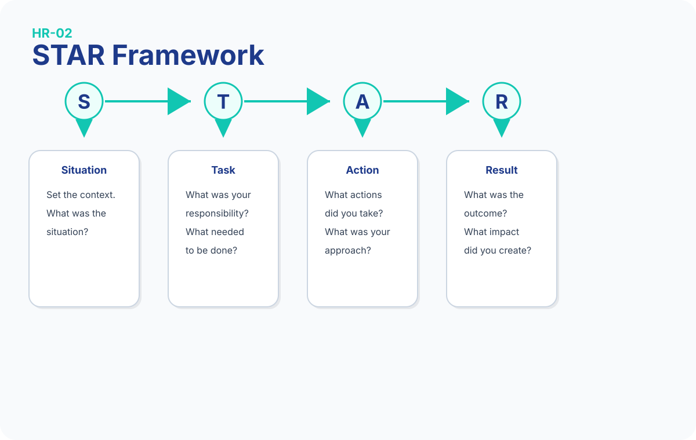

# HR Interview Mastery

# Questions 16–30

This chapter continues the HR interview preparation with behavioural and workplace questions that frequently appear during Junior Data Analyst interviews in the UK.

The goal is not to memorise perfect sentences but to understand how recruiters evaluate your thinking and communication.

---

# Question 16 — Tell me about a time you learned something new quickly.

## Recruiter Psychology

Recruiters want evidence that you can learn new tools and adapt to change.

## Model Answer

> When I decided to move into data analytics, I needed to learn several new tools in a relatively short time.
>
> I completed the GoIT Data Analytics programme, practised SQL, Excel, Power BI and Python, and built projects to apply what I learned.
>
> That experience taught me how to organise my learning and stay consistent.

::: {.callout-tip title="Bogdan Note"}
This is one of your strongest career-transition stories.
:::

::: {.callout-note title="Memory Hook"}
Learn → Practice → Apply
:::

### Common Mistake

Don't simply say:

> "I'm a fast learner."

Show evidence.

---

# Question 17 — Describe a time you improved a process.

## Recruiter Psychology

Analysts improve processes constantly.

Recruiters want initiative.

## Model Answer

> In my previous work I reviewed how tasks moved through our workflow.
>
> I noticed unnecessary delays between steps, suggested a clearer process and improved communication.
>
> The workflow became more organised and easier to manage.

::: {.callout-note title="Memory Hook"}
Observe → Improve → Result.
:::
---

# Question 18 — Tell me about a time you worked with data.

## Recruiter Psychology

Even if this isn't a formal analyst role, recruiters want transferable experience.

## Model Answer

> In my business I regularly reviewed sales information and customer data to understand performance.
>
> I used that information when making decisions about products and priorities.
>
> That experience became one of the reasons I became interested in data analytics.

::: {.callout-tip title="Bogdan Note"}
This answer connects your business experience directly to analytics.
:::

---

# Practice Break

Answer Questions in under **60 seconds** each.

- Tell me about a time you learned something new quickly.
- Describe a time you improved a process.
- Tell me about a time you worked with data.

Try to do it without reading.

---

# Question 19 — How do you deal with repetitive tasks?

## Recruiter Psychology

Data work often includes repetitive processes.

The interviewer wants discipline.

## Model Answer

> I try to stay focused by understanding why the task matters.
>
> I also look for opportunities to organise my work more efficiently while maintaining accuracy.

::: {.callout-note title="Memory Hook"}
Purpose → Accuracy → Efficiency.
:::

### Common Mistake

Don't say repetitive work is boring.

---

# Question 20 — Tell me about receiving feedback.

## Recruiter Psychology

Can you accept feedback professionally?

## Model Answer

> I see feedback as an opportunity to improve.
>
> In previous roles I've received suggestions that helped me become more organised and communicate more clearly.
>
> I try to apply feedback as quickly as possible.

::: {.callout-note title="Memory Hook"}
Listen → Apply → Improve.
:::

---

# Question 21 — Tell me about giving feedback.

## Recruiter Psychology

This measures communication and professionalism.

## Model Answer

> I try to give feedback respectfully and focus on the work rather than the person.
>
> I usually explain what worked well first before suggesting improvements.

### Common Mistake

Avoid sounding confrontational.

---

# Question 22 — How do you organise your work?

## Recruiter Psychology

Organisation is essential for analysts.

## Model Answer

> I usually start by identifying priorities and deadlines.
>
> Then I create a simple task list and review my progress during the day.
>
> This helps me stay organised without losing focus.

::: {.callout-note title="Memory Hook"}
Plan → Track → Review.
:::

---

# Practice Break

Ask yourself:

- Which answer sounds the most natural?
- Which example feels strongest?

---

# Question 23 — Tell me about a time you solved a problem.

## Recruiter Psychology

Problem-solving is one of the core skills for analysts.

## Model Answer

> I once noticed that a workflow was creating unnecessary delays.
>
> I reviewed the process, identified where communication was slowing things down and suggested a clearer approach.
>
> The workflow became more efficient afterwards.

::: {.callout-note title="Memory Hook"}
Problem → Analysis → Solution → Result.
:::
---

# Question 24 — How do you stay motivated?

## Recruiter Psychology

Recruiters want consistent motivation.

## Model Answer

> I stay motivated when I can see progress.
>
> I enjoy learning new skills and solving practical problems, so I like setting small goals and improving step by step.

### Common Mistake

Don't rely only on external motivation.

---

# Question 25 — What does success mean to you?

## Recruiter Psychology

The interviewer wants realistic professional values.

## Model Answer

> For me, success means delivering reliable work, continuing to learn and helping the team achieve good results.
>
> I also think success includes building skills that allow me to take on greater responsibility over time.

::: {.callout-note title="Memory Hook"}
Reliable → Learn → Grow.
:::

---

# Practice Break

Record your answers to Questions:

- Tell me about a time you solved a problem.
- How do you stay motivated?
- What does success mean to you?

Listen for:

- clarity
- pace
- confidence

---

# Question 26 — Tell me about working under a deadline.

## Recruiter Psychology

Deadlines are part of everyday analytical work.

## Model Answer

> When I work under deadlines, I first identify the highest-priority tasks.
>
> Then I break the work into manageable steps and monitor my progress.
>
> This helps me stay calm and deliver quality work.

::: {.callout-note title="Memory Hook"}
Prioritise → Break Down → Deliver.
:::

---

# Question 27 — Describe a situation where you took initiative.

## Recruiter Psychology

Recruiters want proactive people.

## Model Answer

> I noticed an opportunity to improve part of our workflow without being asked.
>
> I suggested a practical change, discussed it with the team and helped implement it.
>
> The process became smoother afterwards.

::: {.callout-tip title="Bogdan Note"}
Use examples where you solved problems instead of waiting for instructions.
:::

---

# Question 28 — How do you deal with uncertainty?

## Recruiter Psychology

Analysts often work with incomplete information.

## Model Answer

> I try to gather as much relevant information as possible before making a decision.
>
> If something is unclear, I ask questions instead of making assumptions.
>
> I believe good communication reduces uncertainty.

::: {.callout-note title="Memory Hook"}
Gather → Ask → Decide.
:::

---

# Question 29 — Describe a time you had multiple priorities.

## Recruiter Psychology

This tests workload management.

## Model Answer

> I've had situations where several important tasks needed attention at the same time.
>
> I reviewed deadlines, considered business impact and completed the highest-priority work first.
>
> That helped me meet expectations without losing quality.

### Common Mistake

Don't say you simply worked longer hours.

---

# Question 30 — Why should we believe you'll succeed as a Junior Data Analyst without previous analyst experience?

## Recruiter Psychology

This is one of the most important transition questions.

Recruiters want confidence supported by evidence.

## Model Answer

> Although this would be my first professional Data Analyst role, I already have experience making business decisions using information, working carefully with digital workflows and learning new technical skills.
>
> I've invested significant time in SQL, Excel, Power BI and Python, and I'm ready to continue learning while contributing to the team from day one.

::: {.callout-tip title="Bogdan Note"}
This is your strongest closing answer for career-transition interviews.
:::

::: {.callout-note title="Memory Hook"}
Experience + Skills + Motivation.
:::

### Common Mistake

Never apologise for being junior.

Instead, emphasise what you already bring.

---

# Chapter Summary

## Five Key Memory Hooks

| Concept           | Memory Hook                       |
| ----------------- | --------------------------------- |
| Learning          | Learn → Practice → Apply          |
| Organisation      | Plan → Track → Review             |
| Problem Solving   | Problem → Analysis → Solution     |
| Deadlines         | Prioritise → Break Down → Deliver |
| Career Transition | Experience + Skills + Motivation  |

---

# 5-Minute Interview Drill

Answer these questions without looking at your notes.

| Question                                    | Target |
| ------------------------------------------- | ------ |
| Learned something quickly                   | 60 s   |
| Improved a process                          | 60 s   |
| Worked with data                            | 45 s   |
| Solved a problem                            | 60 s   |
| Why you'll succeed as a Junior Data Analyst | 60 s   |

Focus on speaking naturally rather than memorising every word.

Your goal is confidence, not perfection.

## STAR Framework

The STAR framework helps you structure behavioural interview answers clearly and confidently.

{#fig:star-framework width=100%}

*Figure 2.1 — STAR Interview Framework.*

