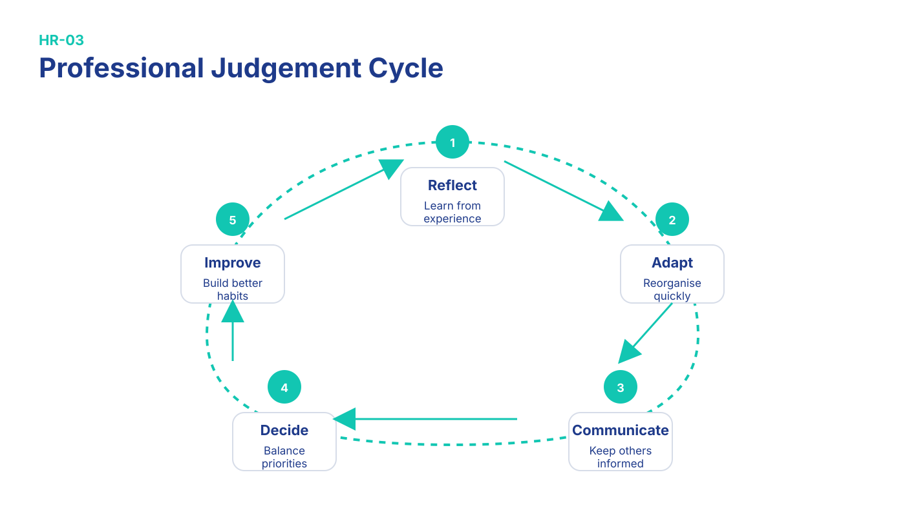

# HR Interview Mastery

# Questions 31–40

This chapter focuses on ownership, communication, adaptability and professional judgement.

These questions are common in behavioural interviews because recruiters want to understand how you think when situations become less predictable.

## Professional Judgement Cycle

Strong behavioural answers usually follow the same mental process: reflect on the situation, adapt your approach, communicate clearly, make a balanced decision and improve afterwards.

{#fig:judgement-cycle width=100%}

*Figure 3.1 — Professional Judgement Cycle.*

### Interview Anchor

**Reflect → Adapt → Communicate → Decide → Improve**

---

# Question 31 — Tell me about a time you had to learn from failure.

## Recruiter Psychology

The interviewer wants to see resilience.

They're looking for someone who reflects, learns and improves instead of becoming defensive.

## Model Answer

> One experience taught me that focusing only on immediate tasks without reviewing the bigger picture can create unnecessary delays.
>
> I reflected on what happened, changed how I planned my work and started checking priorities earlier.
>
> Since then I've become more organised when managing multiple responsibilities.

::: {.callout-tip title="Bogdan Note"}
Focus on the lesson rather than the failure itself.
:::

::: {.callout-note title="Memory Hook"}
Reflect → Adjust → Improve.
:::

### Common Mistake

Don't choose a failure that makes you sound careless or irresponsible.

---

# Question 32 — Describe a time you had to explain something complicated.

## Recruiter Psychology

Analysts often explain technical information to non-technical people.

Communication matters as much as technical knowledge.

## Model Answer

> I try to explain complex ideas using simple language and practical examples.
>
> I usually avoid unnecessary technical terms and check whether the other person understands before continuing.
>
> Clear communication helps everyone make better decisions.

::: {.callout-note title="Memory Hook"}
Simple → Example → Confirm.
:::

### Follow-up Questions

- How do you know someone understands?
- Can you give an example?

---

# Question 33 — How do you handle changing priorities?

## Recruiter Psychology

Business priorities change constantly.

They're checking flexibility.

## Model Answer

> When priorities change, I first understand what has become most important for the business.
>
> Then I reorganise my tasks and communicate if timelines need to change.
>
> Staying flexible helps me deliver the most valuable work first.

::: {.callout-note title="Memory Hook"}
Understand → Reorganise → Communicate.
:::

### Common Mistake

Don't say changing priorities frustrates you.

---

# Practice Break

Answer Questions:

- Tell me about a time you had to learn from failure.
- Describe a time you had to explain something complicated.
- How do you handle changing priorities?

Focus on speaking naturally.

Target:

- 60 seconds each.

---

# Question 34 — Tell me about a time you had to make a difficult decision.

## Recruiter Psychology

They're evaluating judgement.

## Model Answer

> I've had situations where I needed to balance several competing priorities.
>
> I gathered the available information, considered the potential impact and made the decision that best supported the overall goal.
>
> Afterwards I reviewed the outcome so I could learn from the experience.

::: {.callout-note title="Memory Hook"}
Gather → Decide → Review.
:::

---

# Question 35 — What would you do if you didn't know the answer?

## Recruiter Psychology

This is an honesty test.

Good analysts don't pretend to know everything.

## Model Answer

> If I didn't know the answer, I'd first research the problem using available resources.
>
> If I still needed help, I'd ask a colleague while explaining what I'd already tried.
>
> I believe learning efficiently is more important than pretending to know everything.

::: {.callout-tip title="Bogdan Note"}
This answer shows independence before asking for help.
:::

### Common Mistake

Never say you'd guess.

---

# Question 36 — Tell me about a time you worked independently.

## Recruiter Psychology

Junior analysts need supervision, but they also need initiative.

## Model Answer

> In previous roles I've managed responsibilities independently by planning my work and tracking my progress.
>
> When necessary, I communicated updates and asked questions early rather than waiting until problems became bigger.
>
> That helped me stay responsible while working efficiently.

::: {.callout-note title="Memory Hook"}
Plan → Execute → Update.
:::

---

# Practice Break

Record yourself answering Questions: 34–36.

- Tell me about a time you had to make a difficult decision.
- What would you do if you didn't know the answer?
- Tell me about a time you worked independently.

Listen for:

- confidence
- clarity
- pace

---

# Question 37 — Describe a situation where you had to be very accurate.

## Recruiter Psychology

Accuracy is one of the most important qualities for analysts.

## Model Answer

> In my current work, accuracy is essential because small mistakes can affect later stages of the process.
>
> I developed habits like double-checking important details and following consistent workflows.
>
> Those habits are directly relevant to analytical work.

::: {.callout-tip title="Bogdan Note"}
This is a great opportunity to reference your dental laboratory experience.
:::

::: {.callout-note title="Memory Hook"}
Check → Verify → Deliver.
:::

### Common Mistake

Don't simply say you're detail-oriented.

Explain how you ensure accuracy.

---

# Question 38 — How do you react when someone disagrees with you?

## Recruiter Psychology

Conflict management matters.

They're looking for professionalism.

## Model Answer

> I try to understand why the other person sees the situation differently.
>
> Then I focus on discussing facts rather than personalities.
>
> Even if we disagree, I believe respectful communication usually leads to better decisions.

::: {.callout-note title="Memory Hook"}
Listen → Understand → Discuss Facts.
:::

---

# Question 39 — Tell me about a goal you achieved.

## Recruiter Psychology

They want evidence that you finish what you start.

## Model Answer

> One goal I achieved was successfully completing my transition toward data analytics.
>
> I balanced work with learning SQL, Excel, Power BI and Python while completing practical projects.
>
> That experience showed me the importance of consistency over time.

::: {.callout-tip title="Bogdan Note"}
Use your career transition as a personal achievement.
:::

### Common Mistake

Choose a goal with a measurable result whenever possible.

---

# Question 40 — Why should we choose you over another candidate?

## Recruiter Psychology

This is your positioning statement.

They're asking what makes you different.

## Model Answer

> I believe I offer a valuable combination of business experience, technical learning and a strong willingness to grow.
>
> I've already demonstrated that I can learn new skills, adapt to change and work carefully with detailed processes.
>
> I'm ready to bring that mindset into my first Junior Data Analyst role.

::: {.callout-note title="Memory Hook"}
Business + Learning + Reliability.
:::

### Common Mistake

Don't compare yourself negatively with other candidates.

Focus on your own value.

---

# Chapter Summary

::: {.callout-note title="Five Key Memory Hooks"}
| Concept               | Memory Hook                           |
| --------------------- | ------------------------------------- |
| Learning from failure | Reflect → Adjust → Improve            |
| Explaining complexity | Simple → Example → Confirm            |
| Changing priorities   | Understand → Reorganise → Communicate |
| Decision making       | Gather → Decide → Review              |
| Accuracy              | Check → Verify → Deliver              |
:::

---

# STAR Practice

Complete these prompts using the STAR framework.

| Prompt                          | Time |
| ------------------------------- | ---- |
| Learned from failure            | 90 s |
| Explained something complicated | 90 s |
| Worked independently            | 90 s |
| Achieved a goal                 | 90 s |

Remember:

- Situation
- Task
- Action
- Result

---

# End-of-Chapter Reflection

Ask yourself these questions.

- Which answer sounds most natural?
- Which story feels strongest?
- Which answer still sounds memorised?
- Which example could become more specific?

Your goal is not perfect English.

Your goal is sounding like a confident future colleague.
