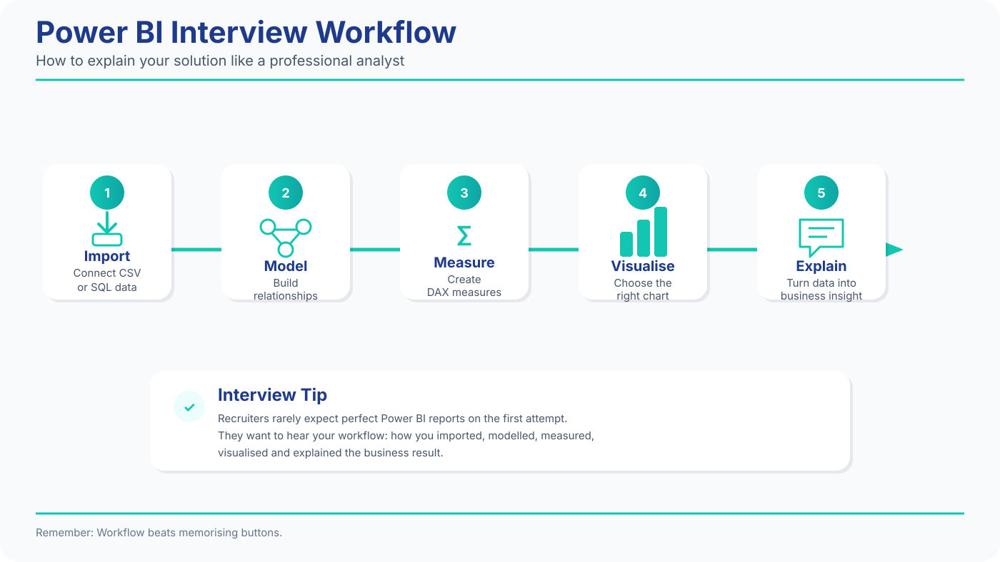
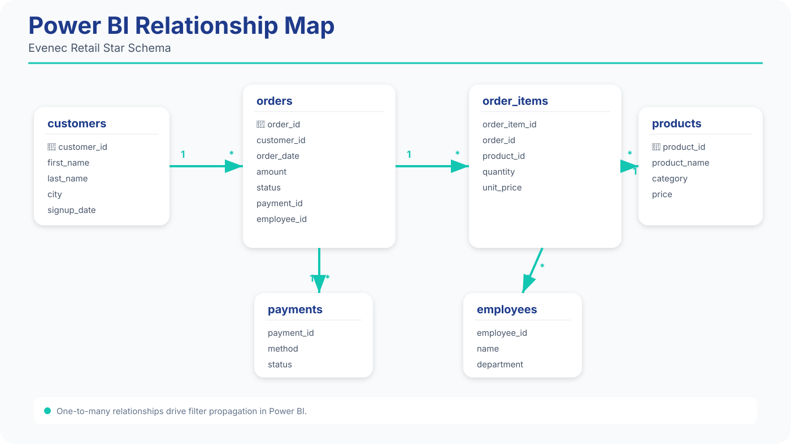
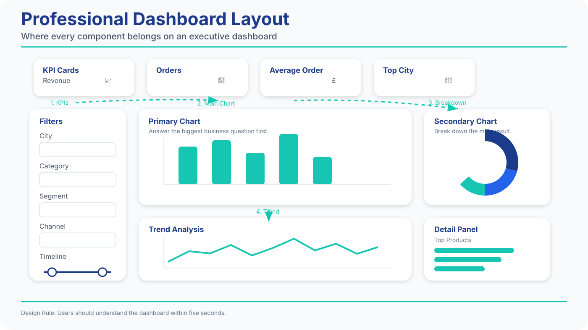

# Power BI Interview Bible

# Sprint 1 — Power BI Foundations

## Import • Data Model • Power Query • First Visuals

Welcome to the Power BI Interview Bible.

This isn't a button-by-button tutorial.

This chapter prepares you for **real Junior Data Analyst interviews in the UK**.

Throughout the Power BI Bible you'll practise with realistic customer, order, product, payment and employee tables similar to those used in UK Data Analyst interviews.

---

# Why Companies Use Power BI

Excel explains yesterday.

Power BI monitors today.

A typical workflow looks like this.

- SQL extracts data.
- Power Query cleans it.
- Power BI models it.
- Dashboards communicate decisions.

::: {.callout-note title="Memory Hook"}
SQL finds.

Excel explores.

Power BI monitors.
:::

## Power BI Interview Framework

When explaining your work during an interview, follow this sequence.

{#fig:powerbi-workflow width=100%}

*Figure 1.0 — Power BI Interview Workflow.*

Remember this order:

**Import → Model → Measure → Visualise → Explain**

Recruiters usually care more about your workflow than remembering every menu click.

---

# Interview Question 1

## Why Power BI?

Recruiter Psychology.

They're checking whether you understand business value.

Good Answer (B2).

> Power BI allows companies to combine data from multiple sources and create interactive dashboards that update automatically.

Don't say.

> It's like Excel.

Power BI is much bigger than Excel.

---

# Step 1 — Create Your First Report

Open Power BI Desktop.

Choose.

**Get Data**

Select.

**Text/CSV**

Import your customer, order, product, payment and employee tables.

Congratulations.

You've created your first report.

---

# Power Query Opens Automatically

Notice.

Power Query appears before the data reaches Power BI.

Think of it as:

> the kitchen before the restaurant.

Business data rarely arrives perfectly clean.

---

# Interview Question 2

## Power Query Basics

Task.

Open a customer table.

Change.

- Date format
- Text format
- Remove unnecessary columns

Why?

Cleaning should happen before analysis.

::: {.callout-note title="Memory Hook"}
Prepare.

Then analyse.
:::
---

# Close & Apply

After cleaning.

Click.

**Close & Apply**

Now the model updates.

Interview English.

> I prefer cleaning data in Power Query because the process is repeatable.

Recruiters like repeatable workflows.

---

# Step 2 — Build the Data Model

Open.

Model View.

You'll see multiple tables.

Now create relationships.

| From               | To                    |
| ------------------ | --------------------- |
| orders.customer_id | customers.customer_id |
| payments.order_id  | orders.order_id       |

Think back to SQL.

These are JOIN relationships.

::: {.callout-note title="Memory Hook"}
Power BI remembers relationships.

SQL recreates them every query.
:::

---

# Star Schema

Most companies use a Star Schema because it keeps reports fast, organised and easier to maintain.

## Relationship Map

Power BI works best when your tables are connected correctly.

{#fig:relationship-map width=100%}

*Figure 1.1 — Star Schema Relationship Map.

Notice how one customer can place many orders, while each order connects to products through order items.

---

# Interview Question 3

Why is Star Schema useful?

Good Answer.

> It makes reports easier to build and improves performance.

---

# Step 3 — Create Your First Visual

Choose.

Bar Chart.

Fields.

- City
- Revenue

Immediately.

You have business insight.

---

# Visual Types

| Visual | Best For   |
| ------ | ---------- |
| Bar    | Comparison |
| Line   | Trends     |
| Card   | KPI        |
| Table  | Details    |
| Map    | Locations  |

::: {.callout-note title="Memory Hook"}
One question.

One visual.
:::

---

# Step 4 — Create KPI Cards

Build.

- Total Revenue
- Total Orders
- Average Order

These become executive cards.

Exactly like Excel.

---

# Dashboard Layout

A good Power BI dashboard should guide the user's attention from KPIs to business insights.

{#fig:powerbi-dashboard-layout width=100%}

*Figure 1.2 — Professional Dashboard Layout.*

Notice how KPI cards appear first, followed by the main visual, supporting charts and interactive filters.

---

# Step 5 — Add Filters

Power BI calls them.

**Slicers**

Add.

- City
- Category
- Date

Now the report becomes interactive.

Exactly what hiring managers expect.

---

# Formatting Like a Professional

Use.

- white background
- dark text
- aligned visuals
- consistent spacing

Avoid.

- rainbow colours
- 3D effects
- unnecessary borders

Business before decoration.

---

# Mini Business Case

The Sales Director asks.

> Which city deserves more marketing budget?

Workflow.

1. Filter.
2. Compare.
3. Explain.

Good Answer.

> London generated the highest revenue, so I'd recommend prioritising additional marketing there.

Notice.

Recommendation.

Not just numbers.

---

# Mini Mock Interview

Interviewer.

> Why use Power Query?

Pause.

Answer.

---

Interviewer.

> Why create relationships?

Pause.

Answer.

---

Interviewer.

> Why choose a Card visual?

Pause.

Answer.

---

# Power BI Cheat Sheet

| Tool        | Purpose       |
| ----------- | ------------- |
| Power Query | Clean         |
| Model View  | Relationships |
| Card        | KPI           |
| Bar Chart   | Compare       |
| Line Chart  | Trend         |
| Slicer      | Filter        |

::: {.callout-note title="Memory Hook"}
Import.

Model.

Visualise.

Explain.
:::

---

# End-of-Sprint Challenge

Using customer, order, product, payment and employee tables.

Complete these tasks.

- Import all CSV files.
- Clean data in Power Query.
- Create relationships.
- Build three KPI cards.
- Build one revenue chart.
- Add one slicer.

Target.

**15 minutes**

Explain every action aloud in English.

Congratulations.

You completed **Power BI Sprint 1**.