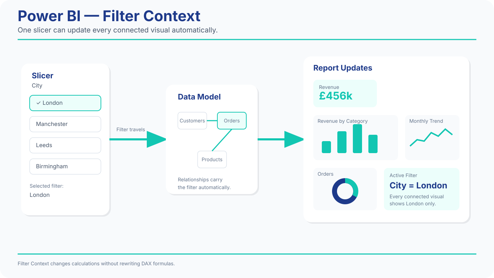
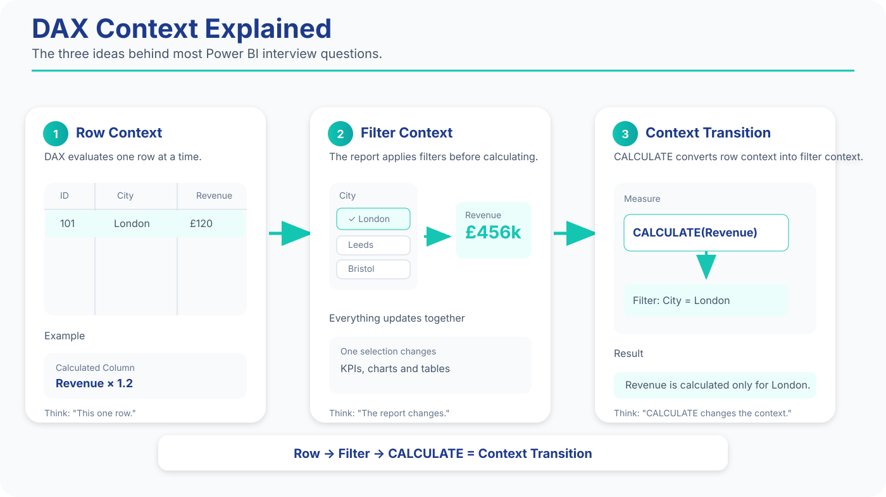

# Power BI Interview Bible

# Sprint 2 — Thinking in DAX

## Measures • CALCULATE • FILTER • RELATED • ALL

Welcome to Sprint 2.

This chapter teaches the biggest mindset shift in Power BI.

DAX isn't Excel.

DAX thinks in **context**.

Throughout this sprint you'll practise with realistic customer, order, product, payment and employee tables similar to those used in UK Data Analyst interviews.

---

# What Makes DAX Different?

Excel asks.

> "What's in this cell?"

DAX asks.

> "Which rows are currently visible?"

::: {.callout-note title="Memory Hook"}
Excel thinks in cells.

DAX thinks in context.
:::

---

# Understanding Context

Imagine.

Your report is filtered to:

- London
- January

When you calculate Revenue,

DAX automatically uses only those rows.

That's called **Filter Context**.

---

# Two Types of Context

| Context        | Meaning              |
| -------------- | -------------------- |
| Row Context    | Current row          |
| Filter Context | Current visible data |

Interview Tip.

Being able to explain these two concepts is more valuable than memorising dozens of functions.

## How Filter Context Works

One filter can update your entire report.

{#fig:filter-context width=100%}

*Figure 2.1 — How Filter Context flows through a Power BI report.*

Notice how a single slicer selection changes every connected visual automatically.

---

# Interview Question 4

Explain Filter Context.

Good Answer (B2).

> Filter Context is the set of filters currently affecting a calculation, such as city, category or date.

Simple.

Professional.

Correct.

---

# Your First Measure

Open.

Model View.

Create.

New Measure.

Write.

```DAX
Total Revenue =
SUM(Orders[amount])
```

Why a Measure?

Because it updates automatically whenever filters change.

::: {.callout-note title="Memory Hook"}
Measures breathe.

Columns stay fixed.
:::

---

# Calculated Column vs Measure

| Calculated Column | Measure        |
| ----------------- | -------------- |
| Stored            | Calculated     |
| Every row         | Entire context |
| Static            | Dynamic        |

Business Example.

Customer Tier.

→ Column.

Total Revenue.

→ Measure.

---

# Interview Question 5

Why use a Measure?

Model Answer.

> Measures recalculate automatically whenever report filters change.

Recruiters love this answer.

---

# COUNT vs COUNTROWS

Two similar functions.

Different purpose.

```DAX
Total Orders =
COUNTROWS(Orders)
```

Why COUNTROWS?

Because you're counting records.

Not values.

::: {.callout-note title="Memory Hook"}
Rows.

Not cells.
:::

---

# AVERAGE

Create.

```DAX
Average Order =
AVERAGE(Orders[amount])
```

Now compare.

- Revenue
- Orders
- Average Order

You're building executive KPIs.

---

# CALCULATE

This is the heart of DAX.

Formula.

```DAX
London Revenue =
CALCULATE(
    [Total Revenue],
    Customers[city]="London"
)
```

Notice.

You're changing the context.

::: {.callout-note title="Memory Hook"}
CALCULATE changes context.
:::

---

# Why CALCULATE Matters

Without it.

Current filters remain.

With it.

You create new business questions.

Examples.

- London only
- Electronics only
- Last year only

This is why CALCULATE appears in almost every real project.

---

## How CALCULATE Changes Context

This is the biggest "aha moment" in DAX.

Instead of calculating using the current report state, **CALCULATE()** creates a new filter context before returning the result.

{#fig:dax-context width=100%}

*Figure 2.2 — Row Context, Filter Context and Context Transition.*

### Interview Anchor

Remember this sequence:

**Row → Filter → CALCULATE**

If you can explain these three ideas clearly, you'll answer many Junior Power BI interview questions with confidence.

---

# FILTER

Sometimes conditions become more complex.

Example.

```DAX
Large Orders =
CALCULATE(
    [Total Revenue],
    FILTER(
        Orders,
        Orders[amount]>200
    )
)
```

Business Meaning.

Revenue from high-value purchases.

Interview English.

> FILTER allows me to create more specific business conditions.

---

# RELATED

Power BI already knows relationships.

Now use them.

Example.

```DAX
Customer City =
RELATED(Customers[city])
```

Think back.

SQL.

```sql
JOIN
```

Excel.

```
XLOOKUP
```

Power BI.

```
RELATED
```

Same business goal.

Different tool.

---

# RELATEDTABLE

Imagine.

You're inside Customers.

You want.

All related orders.

Use.

```DAX
RELATEDTABLE(Orders)
```

::: {.callout-note title="Memory Hook"}
RELATED looks outward.

RELATEDTABLE looks inward.
:::

---

# ALL

One of the most important interview functions.

Example.

```DAX
Revenue % =
DIVIDE(
    [Total Revenue],
    CALCULATE(
        [Total Revenue],
        ALL(Customers)
    )
)
```

Business Meaning.

Current revenue.

Compared to total company revenue.

Exactly what executives ask.

---

# DIVIDE

Don't write.

```DAX
A/B
```

Use.

```DAX
DIVIDE(A,B)
```

Why?

Safer.

No divide-by-zero errors.

Interview Tip.

Using DIVIDE instead of `/` shows professional habits.

---

# Time Intelligence Preview

Next sprint goes deeper.

For now.

Create.

```DAX
Current Year Revenue =
TOTALYTD(
    [Total Revenue],
    Orders[order_date]
)
```

Notice.

Power BI understands dates differently from Excel.

---

# Mini Business Case

The Sales Director asks.

> How much revenue came from London?

Use.

CALCULATE.

Then answer.

> London generated £X in revenue.

Business language matters.

---

# Mini Business Case

Question.

> What percentage of total revenue comes from Electronics?

Hint.

Use.

- CALCULATE
- ALL
- DIVIDE

Think before writing.

---

# Common DAX Mistakes

Avoid.

❌ Using calculated columns instead of measures.

❌ Forgetting relationships.

❌ Ignoring Filter Context.

❌ Dividing manually.

::: {.callout-note title="Memory Hook"}
Think.

Context.

Then formula.
:::

---

# DAX Cheat Sheet

| Function     | Purpose             |
| ------------ | ------------------- |
| SUM          | Add values          |
| COUNTROWS    | Count records       |
| AVERAGE      | Average             |
| CALCULATE    | Change context      |
| FILTER       | Complex conditions  |
| RELATED      | Bring related value |
| RELATEDTABLE | Return related rows |
| ALL          | Remove filters      |
| DIVIDE       | Safe division       |

Keep this table nearby.

---

# Mini Mock Interview

Interviewer.

> What's the difference between a Measure and a Column?

Pause.

Answer.

---

Interviewer.

> Why use CALCULATE?

Pause.

Answer.

---

Interviewer.

> What does ALL do?

Pause.

Answer.

---

# End-of-Sprint Challenge

Using customer, order, product, payment and employee tables.

Build these measures.

- Total Revenue
- Total Orders
- Average Order
- London Revenue
- Large Orders Revenue
- Revenue Percentage
- Current Year Revenue

Target.

**20 minutes**

Then explain each measure aloud in English.

---

::: {.callout-note title="Memory Hooks"}
| Concept   | Hook            |
| --------- | --------------- |
| Measure   | Breathes with   |
|           |  filters        |
| Column    | Stored          |
| CALCULATE | Changes reality |
| FILTER    | More specific   |
| RELATED   | SQL JOIN        |
| ALL       | Remove filters  |
| DIVIDE    | Stay safe       |
:::

Congratulations.

You completed **Power BI Sprint 2**.
